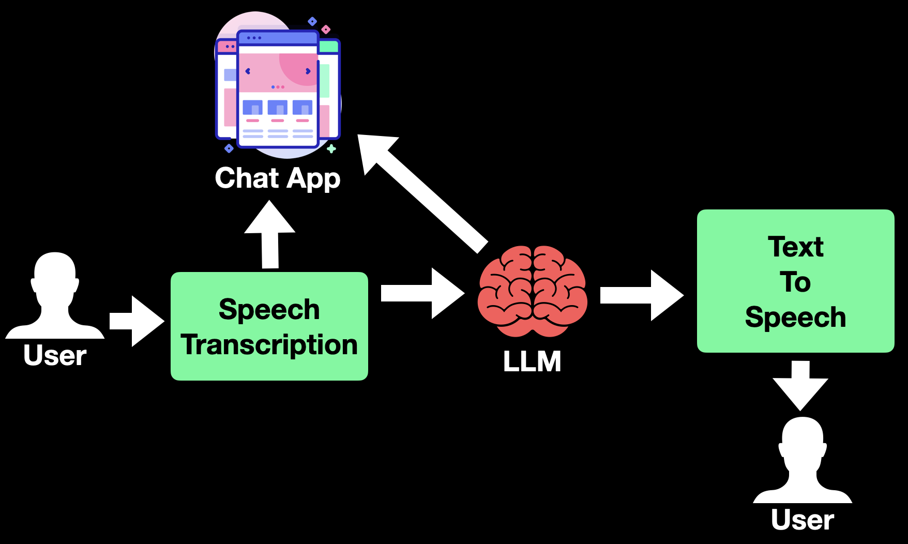

# Locxa - Your Local Alexa 

<div align='center'>
     <p>
        <a href='https://youtu.be/8vPPwL9zlFA?si=MqQW5_INfRx-vuWi'></a>
    </p>
</div>
A simple Alexa style AI assistant that can be readily downloaded and setup on your Laptop!

## Overview of the App 
Below is an overview of the pipeline or flow in the app from speech transcription, feeding the LLM, and converting the generated text back to speech using text-to-speech.


## Getting started
To get started, first make sure Ollama is available on your system. If not, it can be downloaded from this [page](https://ollama.com/download). 
Once downloaded, we will be pulling and running the `Llama 3.1` model from the Ollama page [here](https://ollama.com/library/llama3.1) using the command:
```
ollama run llama3.1
```
As we plan to run the app on laptops, we prefer Ollama as it provides the quantized version. 

### Install
* Create a virtual environment for Locxa
```
conda create -n "locxa" python==3.11
conda activate locxa
```
* Checkout the code and install the requirements.
```
git clone git@github.com:ai-bites/locxa.git
cd locxa 
pip install -r requirements.txt
```
* Start the app
```
streamlit run app.py
```
It should startup and run locally and provide a local URL.